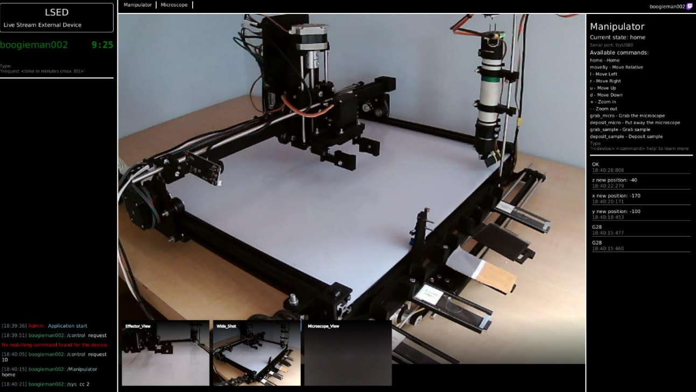

# LSED
Live Stream External Device

This project allows to share the control of devices connected to the computer via live stream service like for example Twitch.tv or YouTube Live.

It provides features like:
- Device communication via serial ports
- Live stream chat reading
- User command interpretation based on commands provided in the YAML configuration for each external device with parameter types and error detection. Users issue commands sending messages in the live stream chat </br>
`!<device id or name> <command prefix> <command parameters>`
- User control queue
- Visual feedback using web-cams assosiated with each device.
- Multiple build-in commands:
  - `!sys cd`, `!sys cc` - Changing devices and cameras in the main view
  - `!control request` - Requesting control
  - `!help` - Getting help for each supported device command
  - `!ban` - Banning users from requesting control
- Finite state machine control which allows to specify in which device state selected commands can be used.
- Scenario-type commands allow to combine multiple device inscructions into one user command using variables to be sent synchronously.

Practical demonstration can be found at [TwitchMicroscope](https://github.com/mateuszbugaj/TwitchMicroscope).



To use, modify existing yaml config file at `src/main/resources/LSEDConfig.yaml` or create your own.
There, provide configurations for devices and streams as well as manage users, log files and other properties.

```yaml
deviceConfigDir: [xxx.yaml, yyy.yaml]
streamConfigDir: []
```

Example of a device config file:
```yaml
# Manipulator
name: Manipulator # Name showed in the app
portName: ttyUSB0 # USB port used for communication
portBaudRate: 9600
initialState: "start" # Initial state of the FSM
confirmation: "OK" # Used for synchronous communication
cameras: # List of cameras associated with the device
  - name: "Main View" # Camera name showed in the app
    portName: "/dev/video4" # Cameras can be shared with many devices
  - name: "Side View"
    portName: "/dev/video5"
commands: # List of commands for this device
  - name: "Move Relative" # Command name showed in the app
    description: "Move device by distance of millimeters." # Showed to users with !help build-in command along with parameters
    prefix: "moveBy" # prefix for using the command
    output: "G0 $XAxisDistance $YAxisDistance $ZAxisDistance" # What is sent to the device which can include parameters by name
    params: # List of command parameters
      - name: "XAxisDistance" # Commands can share name as long as number or type of parameters is unique
        type: Integer # Type can be String or Integer
        range: [-100, 100] # Optional list of allowed range or values for String type parameter
      - name: "YAxisDistance"
        type: Integer
        range: [-100, 100]
        optional: true
        predefined: 0
      - name: "ZAxisDistance"
        type: Integer
        range: [-100, 100]
        optional: true
        predefined: 0
  # Scenario-type command
  - name: "Grab the microscope"
    description: "Grab the microscope"
    requiredStates: [ "sample_grabbed" ] # The FSM state required for this command
    resultingState: "microscope_grabbed" # The FSM resulting state
    prefix: "grab_micro"
    vars: { # List of variabels to be used in the scenario
      X1: "150",
      Y1: "0",
      Z1: "10",
      Y2: "-100",
      Y3: "-127",
      [...]
    }
    events: [ # List of device instructions to be sent with variables to help change parameters
              "G91",
              "G0 $X1 $Y1 $Z1",
              "M 100",
              "F 30",
              "G0 $X1 $Y3 $Z1",
              [...]
    ]
```
Users can send command to the device typing `!Manipulator moveBy 10 5`.

Example of Twitch stream config file:
```yaml
service: twitch
name: UserName
token: oauth:xxx
```

Example of YouTube stream config file:
```yaml
service: youtube
name: UserName
channelId: <id>
token: <token>
```

Run by passing the config file path:
```bash
mvn javafx:run -Djavafx.args="src/main/resources/LSEDConfig.yaml"
```